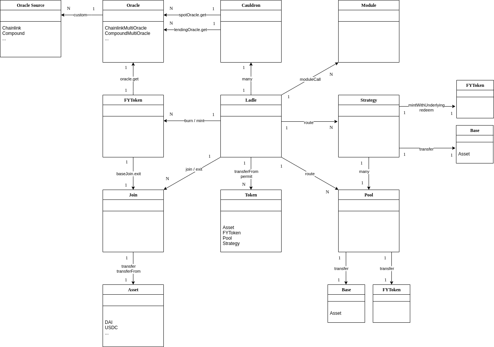

[Data in Google Sheets](https://docs.google.com/spreadsheets/d/1mLlq9iZNe99YTovS1tGGxc4SuQm5aG52XdXEDVTLxlg)

| ↓ Host \ User →  |Cauldron|Ladle                                |Witch                           |Witch v2                        |FYToken                                    |Roller                    |Giver                |YieldLever                                  |NotionalJoin                               |
|------------------|--------|-------------------------------------|--------------------------------|--------------------------------|-------------------------------------------|--------------------------|---------------------|--------------------------------------------|-------------------------------------------|
|Cauldron          |        |build(address,bytes12,bytes6,bytes6) |give(bytes12,address)           |give(bytes12,address)           |                                           |                          |give(bytes12,address)|                                            |                                           |
|                  |        |destroy(bytes12)                     |slurp(bytes12,uint128,uint128)  |slurp(bytes12,uint128,uint128)  |                                           |                          |                     |                                            |                                           |
|                  |        |tweak(bytes12,bytes6,bytes6)         |                                |                                |                                           |                          |                     |                                            |                                           |
|                  |        |give(bytes12,address)                |                                |                                |                                           |                          |                     |                                            |                                           |
|                  |        |pour(bytes12,int128,int128)          |                                |                                |                                           |                          |                     |                                            |                                           |
|                  |        |stir(bytes12,bytes12,uint128,uint128)|                                |                                |                                           |                          |                     |                                            |                                           |
|                  |        |roll(bytes12,bytes6,int128)          |                                |                                |                                           |                          |                     |                                            |                                           |
|Ladle             |        |                                     |                                |                                |                                           |                          |                     |                                            |                                           |
|Witch             |        |                                     |                                |                                |                                           |                          |                     |                                            |                                           |
|Witch v2          |        |                                     |                                |                                |                                           |                          |                     |                                            |                                           |
|Joins             |        |join(address,uint128)                |join(address,uint128)[for bases]|join(address,uint128)[for bases]|join(address,uint128)[for their underlying]|                          |                     |                                            |                                           |
|                  |        |exit(address,uint128)                |exit(address,uint128)[for ilks] |exit(address,uint128)[for ilks] |exit(address,uint128)[for their underlying]|                          |                     |                                            |                                           |
|FYToken           |        |mint(address,uint256)                |                                |burn(address,uint256)           |                                           |                          |                     |                                            |                                           |
|                  |        |burn(address,uint256)                |                                |                                |                                           |                          |                     |                                            |                                           |
|Pool              |        |                                     |                                |                                |                                           |                          |                     |                                            |                                           |
|Strategy          |        |                                     |                                |                                |                                           |startPool(uint256,uint256)|                     |                                            |                                           |
|Roller            |        |                                     |                                |                                |                                           |                          |                     |                                            |                                           |
|Giver             |        |                                     |                                |                                |                                           |                          |                     |give(bytes12,address) seize(bytes12,address)|exit(address,uint128)[for their underlying]|
|Oracle            |        |                                     |                                |                                |                                           |                          |                     |                                            |                                           |

| ↓ Host \ User → |Developer          |Multisig                   |Timelock  |Cloak  |
|-----------------|-------------------|---------------------------|----------|-------|
| Timelock        | "propose execute" | "propose approve execute" | ROOT     | None  |
| Cloak           | execute           | "execute restore ROOT"    | All      | None  |
| Contracts       | None              | None                      | All      | ROOT  |
